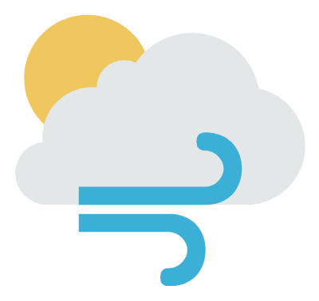

<h1 align="center">
    
    
Happy Weather

</h1>
<h4 align="center">
  🚀 Fake Aplication created for CodeTest
</h4>

  

  

  

  

  

  <a href="#tecnologies">Tecnologies</a>&nbsp;&nbsp;&nbsp;|&nbsp;&nbsp;&nbsp;
  <a href="#project">Project</a>&nbsp;&nbsp;&nbsp;|&nbsp;&nbsp;&nbsp;
  <a href="#requirements">Requirements</a>&nbsp;&nbsp;&nbsp;|&nbsp;&nbsp;&nbsp;
  <a href="#clone-the-repository">Clone the repository</a>&nbsp;&nbsp;&nbsp;|&nbsp;&nbsp;&nbsp;
  <a href="#mockups">Mockups</a>&nbsp;&nbsp;&nbsp;|&nbsp;&nbsp;&nbsp;
  <a href="#license">Licença</a>

 

## Tecnologies

This project was made with this tecnologies:

- [Node.js](https://nodejs.org/en/)
- [React](https://reactjs.org/)
- [React Native](https://facebook.github.io/react-native/)

## Project

This project is an application to get some information about weather. You can use your own GPS or choose your location.

## Requirements

- [Node](https://nodejs.org/pt-br/download/)
- [Yarn](https://yarnpkg.com/cli/install)
- [JDK 8](https://www.oracle.com/java/technologies/javase/javase-jdk8-downloads.html) or higher
- [Genymotion](https://www.genymotion.com/fun-zone/) If you are not with your Android Device
- [Google Console](https://console.cloud.google.com/?_ga=2.267416461.265247016.1626111418-1354501070.1621456978&_gac=1.253082875.1626111418.Cj0KCQjw0K-HBhDDARIsAFJ6UGg9LBbubB2Kw9aFknpBFX45o0Azk8dblkiuaZf0jXrDIPpP-znTbM8aAmW0EALw_wcB)

## Clone the repository

**This App was only tested on Android Platform**

- on your google console project, you have to enable Geocoding API and get KEY credential;
- Create an open weather project and get the credential;
- Enter on weatherapp root folder;
- Create and edit .env according to .env.example with your KEYS;
- Run `yarn` to install de dependencies;
- Open the emulator or an Android Phone plugged on Computer and Run `react-native run-android` and `react-native start` or `yarn dev` for android.

## Mockups

- [FIGMA](https://www.figma.com/file/lu3rrVbi7z350DsJiN2545/WeatherApp)

## How to contribute

- Do it a fork from this repository;
- Create a branch with your feature: `git checkout -b my-feature`;
- Do commits of your Changes: `git commit -m 'feat: My new feature'`;
- Do it a push for your branch: `git push origin my-feature`.

After the merge of your pull request will have done, You can delete your branch.

## License

This project is under the MIT license. See the archive [LICENSE](LICENSE.md) for more details.

---

Made by Caique Roschel
